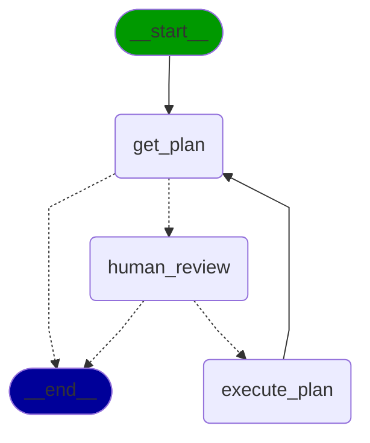

# 🪄 Juju Spell 🪄

Juju Spell is a Juju plugin that bring LLM into Juju Ecosystem. It allows you to perform operations with nature language
without being a Juju command line wizard. This plugin is built with langchain and langgraph, and the graph for the agent
looks like this:



> [!WARNING]
> This plugin is still under development !!!

## Quick Start

Currently, only local installation is available.

**Install via uv**

```shell
uv venv
uv pip install .
source .venv/bin/activate

# Optional if you already have ollama running locally
snap install ollama
ollama pull llama3.1
```

**Install via snap**

```shell
snapcraft pack .
snap install juju
snap install $(ls *juju-spell*) --dangerous

# Need manual approval
snap connect juju-spell:juju-bin juju:juju-bin
snap connect juju-spell:dot-local-share-juju
snap connect juju-spell:dot-local-share-juju-spell

# Optional if you already have ollama running locally
snap install ollama
ollama pull llama3.1
```

Verify installation:

```shell
juju-spell -h
```

## Known issues

Cannot call use it as part of juju's cli, that is `juju spell`. See https://github.com/juju/juju/issues/18888. To
workaround this, `alias juju=/snap/juju/current/bin/juju`.
